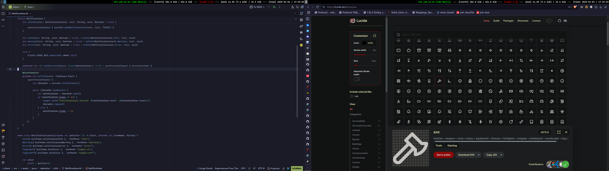

# The nothfiles

my dotfiles. not intended to be used anywhere else.

## stuff used

- Window manager: hyprland
- Terminal: alacritty (catppuccin theme), fish, starship (catppuccin theme)
- Editor: neovim (no nixvim anymore, plain lua is better) sometimes when i feel like it i use neovide
- Browser: librewolf (catppuccin blue i think with ublockorigin with almost all filters on)
- Launcher: rofi with wayland patches

### Fonts

Monocraft Nerd Font

## pc specs

- cpu: amd ryzen 7 2700
- gpu: nvidia geforce gtx 1650
- RAM: 1x8GB + 1x16GB random Kingstons
- board: MSI B450M-A PRO MAX (MS-7C52)
